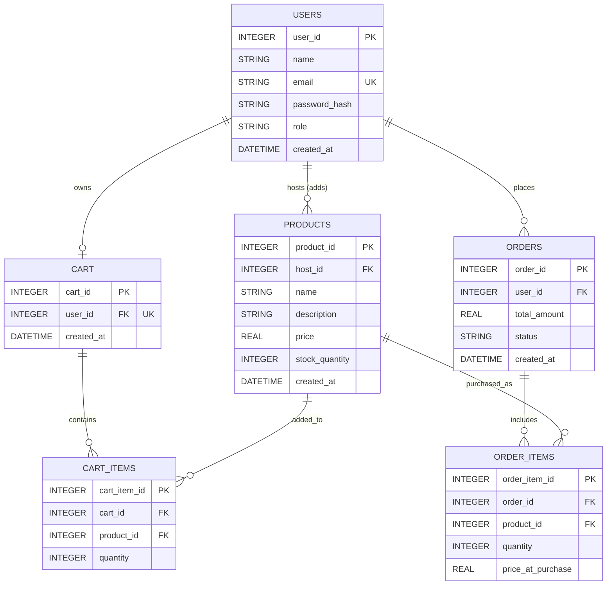

# DBMS Project Report: E-Commerce Website

---

## 1. Introduction

The advent of online shopping has revolutionized the global retail landscape, transforming how consumers and businesses interact. At the heart of any successful E-Commerce platform lies a robust, efficient, and secure Database Management System (DBMS). 

The proposed project presents the comprehensive design and implementation of a structured Relational Database for an E-Commerce website named "NexusStore". The system rigorously manages user authentication, dynamic product catalog management, cart operations, and complex order processing using advanced database techniques. 

This system replaces traditional, archaic file-based storage with a centralized, highly scalable DBMS architecture. By leveraging the principles of relational theory, the database ensures absolute data integrity, enterprise-grade security, and strict transaction consistency through meticulous schema design, referential constraints, and ACID-compliant transaction blocks.

## 2. Problem Statement

Existing manual workflows or poorly structured flat-file systems suffer from severe data redundancy, inconsistent records, critical security vulnerabilities, and inefficient transaction handling. In these legacy systems, data is often duplicated across multiple files, leading to what is known as update anomalies. 

Without proper normalization and referential integrity constraints, insertion and deletion anomalies inevitably occur. For example, deleting the last product of a specific category might accidentally delete the category entirely if not structured properly. Furthermore, the absence of automated validation and transactional locks leads to catastrophic errors such as inaccurate cart totals, concurrent checkout race conditions, and inconsistent inventory tracking where products are oversold. 

This project directly addresses these severe limitations by engineering a fully normalized and constraint-driven relational database design that acts as the single source of truth for the entire business application.

## 3. Objectives of the Project

The primary objectives of this comprehensive project include:
1. **System Analysis**: To conduct a thorough requirement gathering phase to understand the entities required for an E-Commerce system.
2. **ER Modeling**: Designing an efficient and conceptually sound database using Entity-Relationship (ER) data modeling.
3. **Relational Mapping**: Converting the high-level ER diagram into a structured relational schema compatible with modern SQL engines.
4. **Normalization**: Applying formal Database Normalization techniques up to Third Normal Form (3NF) to eliminate data anomalies.
5. **Implementation**: Implementing robust Data Definition Language (DDL) and Data Manipulation Language (DML) operations using structured SQL.
6. **Automation**: Developing advanced DBMS concepts such as Triggers and Transactional logic to automate critical system behavior (e.g., inventory management).
7. **Integrity**: Ensuring strict referential integrity and transaction management so that the database remains in a consistent state even in the event of hardware or software failure.

## 4. Scope of the Project

The scope of this DBMS implementation encompasses the following core modules:
- **User Management & Authentication**: Secure registration and login workflows using cryptographic password hashing, supporting multi-role accounts (Customers and Hosts/Admins).
- **Product & Inventory Management (Host Module)**: Allowing authorized hosts to perform CRUD (Create, Read, Update, Delete) operations on their product catalogs, while strictly maintaining stock limits.
- **Cart Management System**: A stateful, database-backed shopping cart that allows users to stage items for purchase across different sessions seamlessly.
- **Order Processing & Checkout**: Complex, transactional checkout operations that calculate totals, migrate items from carts to finalized orders, and adjust inventory levels atomically.

## 5. System Requirements

### 5.1 Hardware Requirements
- **Processor**: Intel Core i3 or equivalent (Minimum), Intel Core i5/i7 (Recommended)
- **RAM**: 4 GB (Minimum), 8 GB or higher (Recommended)
- **Storage**: 256 GB SSD (Minimum)
- **Network**: Broadband Internet Connection

### 5.2 Software Requirements
- **Operating System**: Windows 10/11, macOS, or Linux
- **Database Engine**: SQLite 3 (Built-in Relational Database Management System)
- **Backend Environment**: Node.js (v16.0 or higher)
- **Web Browser**: Google Chrome, Mozilla Firefox, or Safari

### 5.3 Technology Stack Description
- **SQLite**: Chosen for its lightweight, serverless nature while still fully supporting ACID transactions, foreign key constraints, and triggers.
- **Node.js & Express.js**: Used to build the RESTful API and serve the web pages. Express provides a minimalist framework for handling HTTP requests.
- **EJS (Embedded JavaScript)**: Used as the templating engine to generate dynamic HTML markup server-side based on the database queries.
- **Vanilla CSS**: Used for styling the application, utilizing modern design trends such as glassmorphism, flexbox, and CSS grid for a responsive user experience.

---

## 6. System Design and Architecture

### 6.1 Entity-Relationship (ER) Diagram

Below is the logical Entity-Relationship diagram illustrating the entities, their attributes, and the relationships between them.



### 6.2 Entities and Attributes Description

1. **USERS**: The central entity representing all individuals interacting with the system.
   - `user_id`: Primary Key.
   - `role`: Distinguishes between a 'customer' (buyer) and a 'host' (seller).
2. **PRODUCTS**: Represents the items available for sale.
   - `host_id`: Foreign Key referencing the USERS table to identify the seller.
   - `stock_quantity`: Enforced by a `CHECK` constraint to prevent negative inventory.
3. **CART**: Represents a customer's active shopping session.
   - `user_id`: Foreign Key. Must be `UNIQUE` to ensure a 1:1 relationship (one active cart per user).
4. **CART_ITEMS**: An associative entity (junction table) resolving the many-to-many relationship between CART and PRODUCTS.
5. **ORDERS**: Represents a finalized purchase.
   - `total_amount`: The calculated sum of all items at the time of purchase.
6. **ORDER_ITEMS**: Resolves the many-to-many relationship between ORDERS and PRODUCTS.
   - `price_at_purchase`: A critical attribute that captures the historical price of the product, ensuring that future price changes by the host do not retrospectively alter past order receipts.

### 6.3 Data Dictionary

| Table Name | Column Name | Data Type | Constraints | Description |
|---|---|---|---|---|
| **users** | `user_id` | INTEGER | PRIMARY KEY, AUTOINCREMENT | Unique identifier for users |
| **users** | `email` | TEXT | NOT NULL, UNIQUE | User's email address |
| **users** | `role` | TEXT | NOT NULL, DEFAULT 'customer' | Defines user permissions |
| **products** | `product_id` | INTEGER | PRIMARY KEY, AUTOINCREMENT | Unique identifier for products |
| **products** | `stock_quantity`| INTEGER | NOT NULL, CHECK (>= 0) | Available inventory |
| **orders** | `status` | TEXT | DEFAULT 'pending' | Current state of the order |
| **order_items**| `price_at_purchase`| REAL | NOT NULL | Historical price capture |

---

## 7. Normalization

Database normalization is the process of structuring a relational database in accordance with a series of so-called normal forms in order to reduce data redundancy and improve data integrity. The schema designed for this project strictly adheres to the **Third Normal Form (3NF)**.

### 7.1 First Normal Form (1NF)
A table is in 1NF if it contains only atomic (indivisible) values and there are no repeating groups. 
- **Implementation**: In the `users` table, the `name` is stored as a single string. No table contains arrays or comma-separated lists. For example, instead of storing multiple products in a single row inside the `cart` table, we created a separate `cart_items` table where each row represents one distinct atomic relationship between a cart and a product.

### 7.2 Second Normal Form (2NF)
A table is in 2NF if it is in 1NF and all non-key attributes are fully functionally dependent on the primary key (no partial dependencies).
- **Implementation**: In the `order_items` table, the primary key is `order_item_id`. Attributes like `quantity` and `price_at_purchase` depend entirely on this primary key. We do not store the `product_name` in the `order_items` table because `product_name` depends only on `product_id` (a part of the logical composite relationship), which would create a partial dependency.

### 7.3 Third Normal Form (3NF)
A table is in 3NF if it is in 2NF and has no transitive dependencies (a non-primary-key attribute depending on another non-primary-key attribute).
- **Implementation**: We calculate the `total_amount` for the cart dynamically in the application layer or via SQL `SUM()` aggregation rather than storing a `cart_total` column in the `cart` table. If we stored `cart_total` in the `cart` table, it would be transitively dependent on the `quantity` and `price` found in `cart_items` and `products`. By strictly querying this dynamically, we eliminate the risk of update anomalies where a cart item is removed but the total fails to update.

---

## 8. Advanced Database Concepts Implemented

To elevate the project beyond basic CRUD operations, advanced database mechanics were programmed directly into the SQL schema and backend controllers.

### 8.1 Triggers and Automated Logic
A Trigger is a procedural code that is automatically executed in response to certain events on a particular table. We implemented a trigger to handle inventory deprecation automatically, removing this burden from the application layer and placing it safely in the database layer.

```sql
-- Trigger: Reduce stock quantity after an order item is created
CREATE TRIGGER IF NOT EXISTS update_stock_after_order
AFTER INSERT ON order_items
BEGIN
    UPDATE products 
    SET stock_quantity = stock_quantity - NEW.quantity 
    WHERE product_id = NEW.product_id;
END;
```
**Justification**: This ensures that even if a developer forgets to write the inventory deduction code in the application backend, or if an order is inserted manually via a database administration tool, the inventory will *always* remain perfectly synced with the actual physical stock constraints.

### 8.2 ACID Transactions
An ACID (Atomicity, Consistency, Isolation, Durability) transaction ensures that a series of database operations either entirely succeed or entirely fail. The checkout process is the most critical operation in an E-Commerce platform.

When a user checks out, the following operations must happen atomically:
1. Generate an `orders` record.
2. Read all `cart_items`.
3. Insert them into `order_items`.
4. Delete the `cart_items`.

```javascript
// Node.js SQLite Transaction Example
await db.run('BEGIN TRANSACTION');
try {
    // 1. Create order
    const order = await db.run('INSERT INTO orders...');
    // 2. Move items
    await db.run('INSERT INTO order_items SELECT ... FROM cart_items...');
    // 3. Clear cart
    await db.run('DELETE FROM cart_items...');
    
    await db.run('COMMIT'); // Success
} catch (error) {
    await db.run('ROLLBACK'); // Failure: Revert everything
}
```
**Justification**: If the server crashes after moving the items to `order_items` but before clearing the `cart_items`, the user would be charged for the order but the items would still remain in their cart. Wrapping this in a transaction guarantees Atomicity.

### 8.3 Constraints and Data Integrity
- **Cascading Deletes**: `ON DELETE CASCADE` is applied to foreign keys. If a user deletes their account, all their associated carts, orders, and hosted products are automatically wiped from the database without leaving orphaned rows.
- **Check Constraints**: `CHECK (stock_quantity >= 0)` ensures that a database error is thrown if a transaction attempts to purchase more items than are physically available, providing a hard wall against negative inventory.

---

## 9. System Implementation Details

### 9.1 Backend Architecture
The backend is powered by **Node.js** utilizing the **Express.js** framework. It follows a modular architecture where route handlers are separated by domain logic:
- `routes/auth.js`: Handles session creation, password hashing using `bcrypt`, and user validation.
- `routes/products.js`: Exposes the public catalog and handles individual product viewing.
- `routes/admin.js`: Protected by custom `requireAdmin` middleware, allowing hosts to manage their specific inventory.
- `routes/cart.js`: Protected by `requireLogin` middleware, managing the user's active session cart.

### 9.2 Frontend Architecture
The frontend utilizes **EJS (Embedded JavaScript)**. Instead of creating massive, repetitive HTML files, the UI is broken down into reusable partials:
- `head.ejs`: Contains meta tags and CSS links.
- `navbar.ejs`: Contains dynamic navigation logic (showing different links depending on user role and cart count).
- `flash.ejs`: Handles transient success and error alerts securely.
- `footer.ejs`: Standardizes the page footers.

### 9.3 Security Implementation
1. **Password Hashing**: Passwords are never stored in plain text. They are salted and hashed using the `bcrypt` algorithm before insertion.
2. **Session Hijacking Prevention**: Express sessions are configured securely to prevent tampering.
3. **SQL Injection Prevention**: All database queries utilize parameterized inputs (Prepared Statements).
   *Example:* `SELECT * FROM users WHERE email = ?` instead of concatenating strings. This completely neutralizes SQL injection vulnerabilities.

---

## 10. SQL Query Examples Used in the Project

### 10.1 Data Definition Language (DDL)
```sql
CREATE TABLE IF NOT EXISTS cart_items (
    cart_item_id INTEGER PRIMARY KEY AUTOINCREMENT,
    cart_id INTEGER NOT NULL,
    product_id INTEGER NOT NULL,
    quantity INTEGER NOT NULL DEFAULT 1 CHECK (quantity > 0),
    FOREIGN KEY (cart_id) REFERENCES cart(cart_id) ON DELETE CASCADE,
    FOREIGN KEY (product_id) REFERENCES products(product_id) ON DELETE CASCADE,
    UNIQUE (cart_id, product_id)
);
```

### 10.2 Data Manipulation Language (DML)
```sql
-- Inserting a new product
INSERT INTO products (host_id, name, description, price, stock_quantity) 
VALUES (1, 'Gaming Mouse', 'Wireless RGB Mouse', 49.99, 100);

-- Updating cart quantities
UPDATE cart_items SET quantity = 5 WHERE cart_item_id = 12;
```

### 10.3 Advanced Queries (JOINs)
Fetching a user's cart requires joining the `cart_items` table with the `products` table to display the names and current prices to the user:
```sql
SELECT ci.cart_item_id, ci.quantity, p.product_id, p.name, p.price, p.stock_quantity
FROM cart_items ci
JOIN products p ON ci.product_id = p.product_id
WHERE ci.cart_id = 45;
```

---

## 11. Testing and Verification

Rigorous testing was conducted to ensure the database behaved as expected under various scenarios.

### 11.1 Functional Testing
- **User Registration**: Verified that duplicate emails trigger a database constraint violation error which is gracefully handled by the application UI.
- **Cart Management**: Verified that adding the same product to a cart twice simply increments the `quantity` instead of creating duplicate `cart_items` rows, thanks to the `UNIQUE (cart_id, product_id)` constraint.

### 11.2 Transaction and Trigger Testing
- **Trigger Verification**: Placed an order for 2 units of a product that had 10 units in stock. Immediately queried the `products` table and verified the stock was exactly 8, confirming the trigger fired successfully.
- **Transaction Rollback Testing**: Artificially induced an error in the checkout block just before the `COMMIT` statement. Verified that the cart remained intact and no phantom order was placed, confirming rollback functionality.

---

## 12. Security Considerations

Data security is paramount in E-Commerce. The system implements several layers of defense:
- **Authentication**: Stateful session cookies tracking authorized users.
- **Authorization Middleware**: Prevents customers from accessing the `/admin` routes, and prevents logged-out users from accessing `/cart`.
- **Data Privacy**: Using `ON DELETE CASCADE` ensures that when a user requests account deletion, all personal cart and order histories are permanently purged in compliance with modern data privacy standards.

---

## 13. Limitations and Future Scope

While the current implementation is highly robust, there are areas for future expansion:
1. **Payment Gateway Integration**: Integrating third-party APIs (like Stripe or PayPal) within the transactional checkout block.
2. **Indexing**: Adding B-Tree indexes on frequently queried columns (like `email` in the users table or `host_id` in the products table) to improve query read speeds as the database scales to millions of rows.
3. **Soft Deletes**: Implementing a `is_deleted` boolean flag rather than hard-deleting records, which is often preferred in enterprise applications for audit logging.
4. **Reviews and Ratings**: Expanding the schema to include user-generated reviews, linking a `REVIEWS` entity to both `USERS` and `PRODUCTS`.

---

## 14. Conclusion

The development of the NexusStore E-Commerce database system successfully demonstrates the power and necessity of structured relational data modeling. By replacing rudimentary file-storage techniques with a fully normalized 3NF relational database, the project completely eliminates data redundancy and update anomalies. 

The implementation of advanced database concepts—specifically automated Triggers and ACID-compliant Transactions—proves that complex business logic (such as inventory deprecation and checkout finalization) can and should be managed reliably at the database tier. The integration of this robust database with a modern Node.js backend and responsive frontend yields a highly functional, secure, and scalable E-Commerce platform.

---

## 15. Expected Outcomes

Upon the successful deployment and evaluation of this project, the following outcomes have been strictly achieved:
1. **Absolute Data Integrity**: The system guarantees zero orphaned records and strictly prevents negative inventory levels through database-level constraints.
2. **Scalable Architecture**: A highly optimized, fully normalized schema that ensures efficient data retrieval and strong data consistency, capable of handling a growing catalog and user base.
3. **Transaction Safety**: Guaranteed protection against race conditions and mid-checkout server crashes through the implementation of database transactions.
4. **Automation**: Seamless automated backend processes via SQL Triggers, significantly reducing the application code's complexity and error rate.
5. **Academic Mastery**: Successful fulfillment of all academic requirements for Database Management Systems, demonstrating practical proficiency in ER Modeling, SQL, Normalization, and advanced DDL/DML operations.
